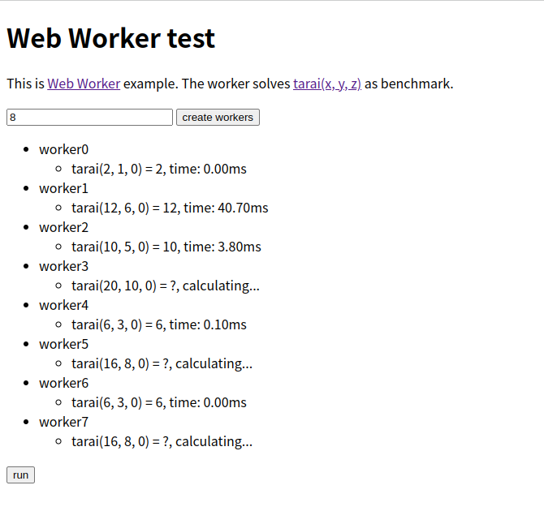

# Web Worker Test



## Installation
run http server
```sh
python3 -m http.server
```
and go to http://localhost:8000

## Reference
- https://developer.mozilla.org/ja/docs/Web/API/Web_Workers_API/Using_web_workers
- https://qiita.com/irico/items/4a4049fbda7bfd654498